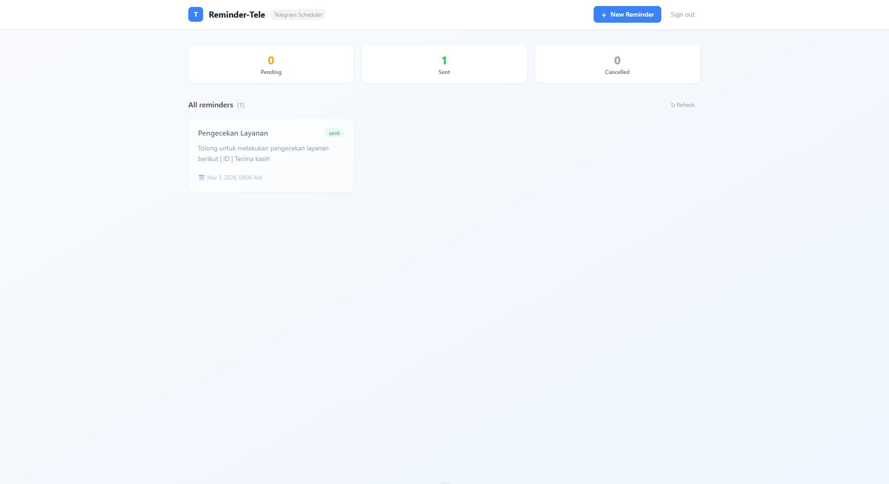

# Reminder-Tele

A Skeddy-like Telegram reminder scheduler built with Nuxt 3. Create reminders via a web dashboard and receive them as Telegram messages at the scheduled time. Supports recurring reminders (daily, weekly, monthly) and quick-pick time presets.



---

## Features

- **Web dashboard** — create, view, edit, cancel, and delete reminders
- **Quick time presets** — +15 min, +1 hr, Tomorrow 8am, Next Mon 9am, etc.
- **Recurrence** — once, daily, weekly, monthly
- **Login protection** — password-protected dashboard with HTTP-only cookie sessions
- **Edit reminders** — edit any reminder; editing a sent/cancelled reminder resets it to pending and reschedules it
- **Auto-refresh** — dashboard polls every 30 seconds so status updates without manual refresh
- **Telegram delivery** — sends messages via Telegram Bot API every minute via cron
- **SQLite** — lightweight file-based database, no external DB required
- **Auto-migration** — database schema is applied automatically on first boot

---

## Tech Stack

| Layer | Technology |
|---|---|
| Framework | Nuxt 3 (full-stack, Nitro server) |
| Database | SQLite via Drizzle ORM + better-sqlite3 |
| Scheduler | node-cron (every minute) |
| Messaging | Telegram Bot API (node-telegram-bot-api) |
| Styling | Tailwind CSS |

---

## Prerequisites

- Node.js 18+
- A Telegram bot token from [@BotFather](https://t.me/BotFather)
- Your Telegram chat ID (send a message to your bot, then check `getUpdates`)

---

## Setup

### 1. Install dependencies

```bash
npm install
```

### 2. Configure environment

Copy the example env file and fill in your credentials:

```bash
cp .env.example .env
```

Edit `.env`:

```env
TELEGRAM_BOT_TOKEN=123456789:ABCdefGHIjklMNOpqrSTUvwxYZ
TELEGRAM_DEFAULT_CHAT_ID=987654321
DATABASE_PATH=./data/reminders.db
DASHBOARD_PASSWORD=your_secure_password
```

> **Note:** If `DASHBOARD_PASSWORD` is left empty, the dashboard is open with no authentication required.

**How to get your chat ID:**
1. Start your bot in Telegram (send `/start`)
2. Open: `https://api.telegram.org/bot<YOUR_TOKEN>/getUpdates`
3. Find `"chat": { "id": ... }` in the response

### 3. Start development server

```bash
npm run dev
```

Open [http://localhost:3000](http://localhost:3000)

The database is created and migrated automatically on first run.

---

## Production

Build and run:

```bash
npm run build
node .output/server/index.mjs
```

---

## Project Structure

```
Remider-Tele/
├── app/
│   ├── app.vue                    # Root component
│   ├── pages/index.vue            # Main dashboard
│   ├── components/
│   │   ├── ReminderForm.vue       # Create/edit reminder modal
│   │   ├── ReminderCard.vue       # Single reminder card with actions
│   │   ├── ReminderList.vue       # Grid of cards
│   │   └── StatusBadge.vue        # Status pill (pending/sent/cancelled)
│   └── composables/
│       └── useReminders.ts        # API fetch wrappers
├── server/
│   ├── plugins/scheduler.ts       # Starts cron job on server boot
│   ├── db/
│   │   ├── schema.ts              # Drizzle table definition
│   │   ├── index.ts               # DB singleton + auto-migration
│   │   └── migrations/            # SQL migration files
│   ├── api/reminders/             # REST endpoints (CRUD)
│   └── utils/
│       ├── telegram.ts            # Bot singleton + sendMessage
│       └── scheduler.ts           # Cron logic + recurrence handling
├── data/reminders.db              # SQLite database (auto-created, gitignored)
├── .env                           # Your credentials (gitignored)
└── .env.example                   # Template
```

---

## API Endpoints

| Method | Endpoint | Description |
|---|---|---|
| `GET` | `/api/reminders` | List all reminders |
| `POST` | `/api/reminders` | Create a reminder |
| `GET` | `/api/reminders/:id` | Get a single reminder |
| `PUT` | `/api/reminders/:id` | Update a reminder |
| `DELETE` | `/api/reminders/:id` | Delete a reminder |

### Create reminder body

```json
{
  "title": "Take medication",
  "message": "Time to take your evening pills 💊",
  "scheduledAt": "2026-03-06T20:00:00.000Z",
  "recurrence": "daily",
  "notes": "Optional private note"
}
```

### Update reminder body (all fields optional)

```json
{
  "title": "Updated title",
  "scheduledAt": "2026-03-07T08:00:00.000Z",
  "status": "pending"
}
```

> **Reschedule tip:** To reschedule a sent/cancelled reminder, send a `PUT` with a new `scheduledAt` and `"status": "pending"`. The dashboard Edit form does this automatically.

---

## Reminder Schema

| Field | Type | Values |
|---|---|---|
| `title` | string | Display name |
| `message` | string | Text sent to Telegram |
| `scheduledAt` | ISO 8601 string | When to send |
| `recurrence` | enum | `once` / `daily` / `weekly` / `monthly` |
| `status` | enum | `pending` / `sent` / `cancelled` |
| `notes` | string | Private note, not sent to Telegram |

---

## Dashboard Behaviour

| Action | Available on | Result |
|---|---|---|
| **Edit** | All reminders | Opens pre-filled form; saving a sent/cancelled reminder resets it to `pending` |
| **Cancel** | Pending only | Sets status to `cancelled` immediately |
| **Delete** | All reminders | Permanently removes the reminder |
| **Auto-refresh** | Always | Dashboard re-fetches data every 30 seconds automatically |

---

## How the Scheduler Works

1. A Nitro server plugin starts `node-cron` when the server boots
2. Every minute, it queries for reminders where `status = 'pending'` AND `scheduled_at <= now()`
3. Each due reminder is sent to Telegram via the Bot API
4. **One-time** reminders → marked `sent`
5. **Recurring** reminders → `scheduled_at` is advanced to the next occurrence, stays `pending`
6. On startup, the scheduler runs immediately to catch any reminders missed during downtime

---

## Telegram Integration Notes

- The bot runs in **send-only mode** (`polling: false`) — no webhook needed
- The default chat ID is set via `TELEGRAM_DEFAULT_CHAT_ID` in `.env`
- The user must send `/start` to the bot before it can send messages
- Messages are formatted with Telegram Markdown

---

## Future Integration

This app is designed to later integrate with a Telegram bot that accepts `/remind` commands directly in chat, storing reminders via the same API and database.
